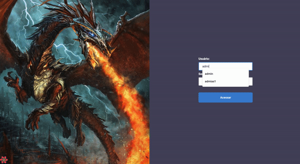

<p align="center">
   
</p>

<p align="center">
   <a href="https://linkedin.com/in/denis-ladeira-814365115/">
      
   </a>
  

  <a href="https://github.com/denismend/si-dragons/commits/dev_v1">
    
  </a>

  
</p>

<p align="center">
  🐉 SI Dragons 🐉 <br />
</p>

<p align="center">
  
</p>

<div align="center">
  <sub>SI Dragons project. Built with ❤︎ by
    <a href="https://github.com/denismend">Denis Ladeira</a>
  </sub>
</div>


# :pushpin: Table of Contents

* [Technologies](#computer-technologies)
* [Features](#rocket-features)
* [How to Run](#construction_worker-how-to-run)
* [Found a bug? Missing a specific feature?](#bug-issues)
* [Contributing](#tada-contributing)
* [License](#closed_book-license)

# :computer: Technologies
This project was made using the follow technologies:

* [Typescript](https://www.typescriptlang.org/)
* [React](https://reactjs.org/)
* [NextJs](https://nextjs.org/)
* [context-api](https://reactjs.org/)
* [styled-components](https://styled-components.com/)
* [axios](https://github.com/axios/axios)
* [jest](https://github.com/facebook/jest)
* [testing-library](https://github.com/testing-library/react-testing-library)

# :rocket: Features

* List of all dragons
* See dragon details
* Edit Dragon
* New Dragon add
* Delete dragon
* User authentication with Login page (admin, admin)


# :construction_worker: How to run
```bash
# Clone the project on your computer via Download (option Code -> Download ZIP)
    - If you want to do it with Git, make sure you have Git installed,
      follow the link https://git-scm.com/
    - then run the command in terminal:
        $ git clone https://github.com/denismend/si-dragons.git

# In the terminal or prompt(cmd), access the project root;
   $ cd si-dragons
```

obs. Make sure you have [Node 17 (stable)](https://nodejs.org/en/) and [npm](https://nodejs.org/en/) 
installed in your computer. You can use [yarn](https://yarnpkg.com) instead npm. We recommend to use stable version.

# :computer: Run Project
```bash
# Install Dependencies
$ npm install
or
$ yarn

# Run Aplication (Dev mode)
$ npm run dev
or
$ yarn dev

# Run Aplication (Build mode)
$ npm run build
$ npm start
or
$ yarn build
$ yarn dev
```
Go to http://localhost:3000/ to see the result.

# :test_tube: Run Tests
```bash
# Install dependencies if you didn't
# Run tests
$ npm run test
or
$ yarn test

# Run test coverage
$ npm run test:coverage
or
$ yarn test:coverage
```
# :bug: Issues

Feel free to **file a new issue** with a respective title and description on the the [DM Store](https://github.com/denismend/si-dragons/issues) repository. If you already found a solution to your problem, **i would love to review your pull request**!

# :tada: Contributing

There are many forms to contribute with the project, first of all you can give this github repo a Star.

If you want do help with the code follow the steps bellow

```ps
# Fork using GitHub official command line
# If you don't have the GitHub CLI, use the web site to do that.
$ gh repo fork denismend/si-dragons

# Clone your fork
$ git clone {your-fork-url}
$ cd si-dragons

# Create a branch with your feature
$ git checkout -b {branch-name}

# Make the commit with your changes
$ git commit -m 'Feat: {feature-name}'

# Send the code to your remote branch
$ git push origin {branch-name}
```

# :closed_book: License

Released in 2021 :closed_book: License

Made with love by [Denis Ladeira](https://github.com/denismend) 🚀.
This project is under the [MIT license](./LICENSE).
